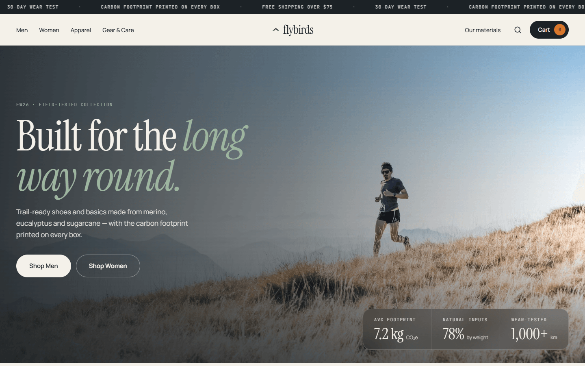
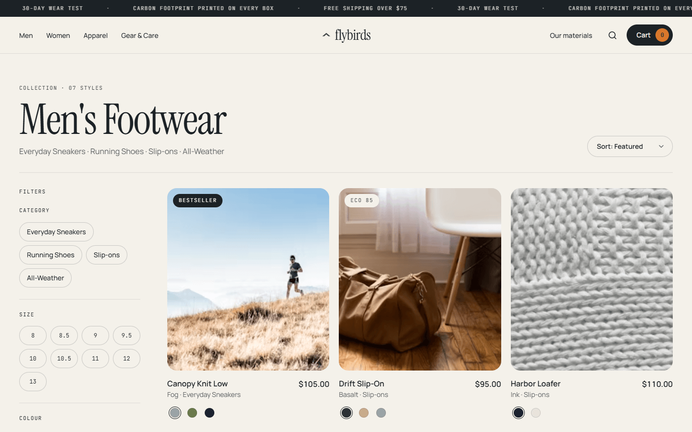
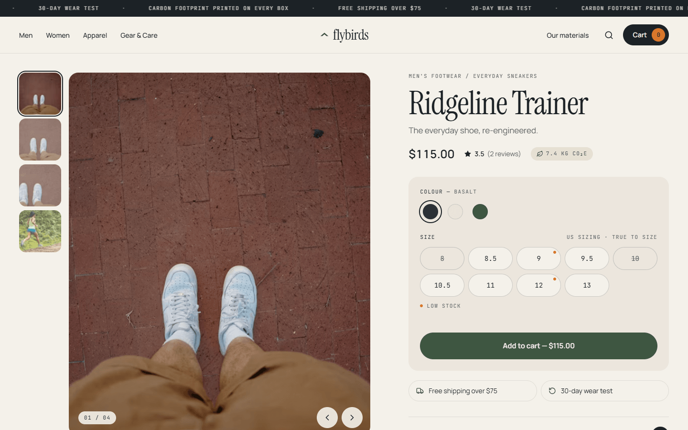
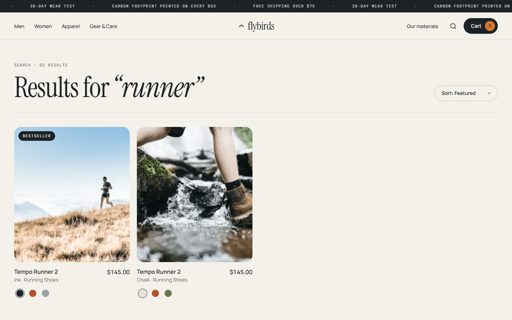
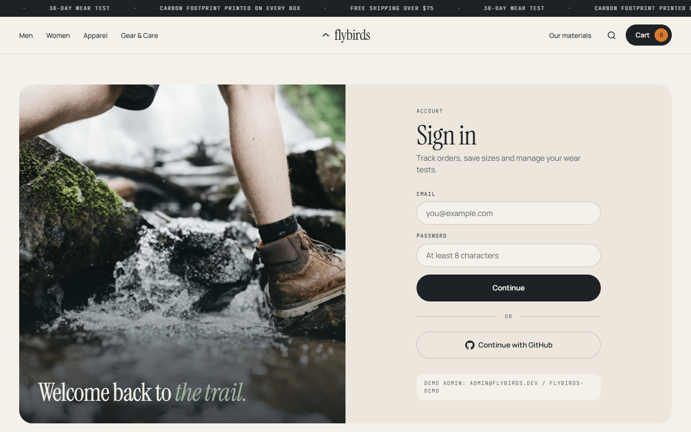
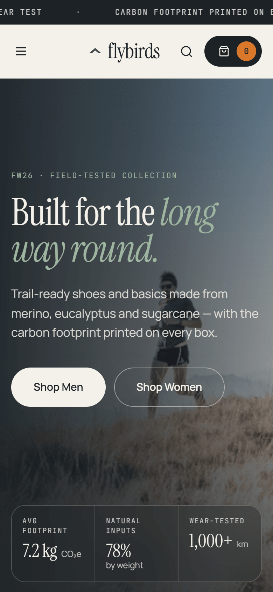
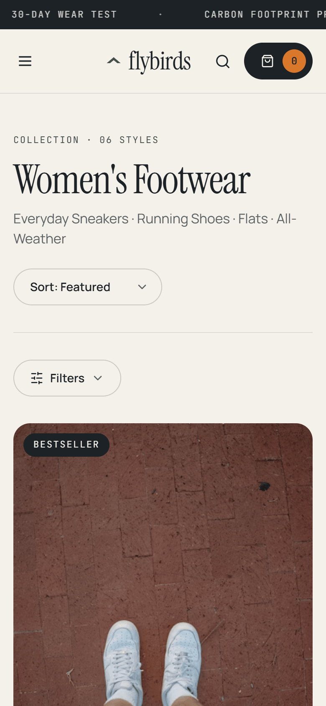
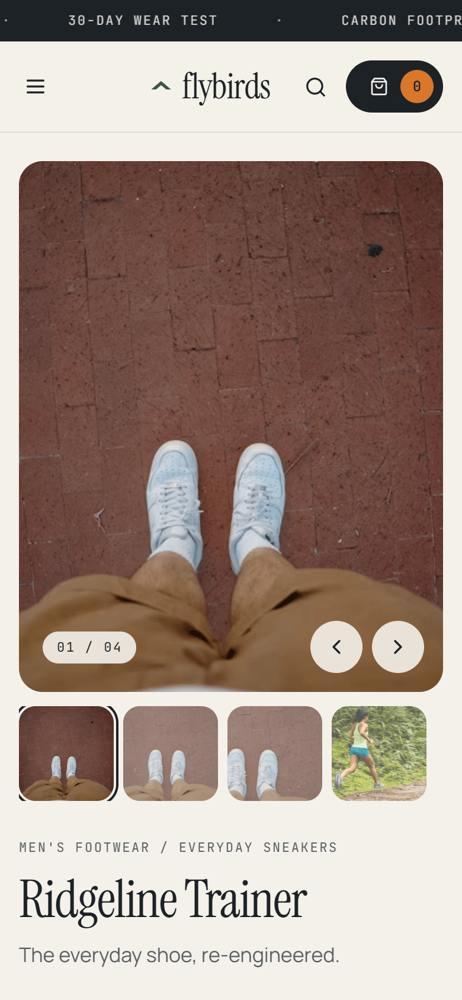

# Flybirds

A production-grade DTC footwear storefront built as a senior full-stack portfolio piece.
Next.js App Router · TypeScript (strict + `noUncheckedIndexedAccess`) · Prisma/Postgres · Auth.js v5 RBAC · Zustand + TanStack Query · Tailwind v4 · Framer Motion.

**Live demo:** https://flybirds-store.web.app (static preview — see [Live demo](#live-demo))  ·  **Portfolio:** https://abanoub--rashad.web.app

## Screenshots

| Home | Collection (faceted filters) |
|---|---|
|  |  |
| **Product page** | **Search** |
|  |  |
| **Sign in** | |
|  | |

<p>
  
  
  
</p>

## Quick start

```bash
cp .env.example .env            # then: npx auth secret
docker compose up -d            # Postgres 16
npm install
npm run db:push && npm run db:seed
npm run dev
```

Demo admin: `admin@flybirds.dev` / `flybirds-demo`

## Live demo

https://flybirds-store.web.app is a static export of the same UI, hosted on Firebase like the rest of the portfolio. The full app needs a Node server and PostgreSQL, so `npm run build:demo` builds a variant that:

- reads the catalog in memory from `prisma/catalog.ts` (the same data `db:seed` writes, so stock and reviews match);
- prerenders every collection and product page, then applies faceted filters, sort and search in the browser from the URL;
- keeps the optimistic cart client-only (no server reconciliation);
- shows the ops page read-only and replaces sign-in with an explainer (Auth.js needs the server).

The demo-only files live in `demo/overlay/` and are laid over a temporary copy of the app, so the real code paths stay untouched.

```bash
npm run build:demo     # → ./out
npm run deploy:demo    # build + firebase deploy (site: flybirds-store)
```

## Architecture

```
prisma/                 schema + deterministic seed (20 products, ~800 variants)
src/
  app/                  routing only — thin pages that compose features
    (shop)/collections/[category]   faceted PLP (RSC, URL-driven)
    (shop)/products/[slug]          PDP + JSON-LD
    (auth)/sign-in                  credentials + GitHub via server actions
    admin/                          RBAC-gated (middleware + requireAdmin)
    api/visual/[shape]              procedural SVG product renders (no binary assets)
  features/             vertical slices: cart/, catalog/, product/
  server/
    queries/            read-side, `server-only`, React `cache()`-wrapped
    actions/            write-side Server Actions, zod-validated input
  components/           design-system primitives (shadcn-style) + layout
  lib/                  db client, env validation, money utils
  auth.ts / auth.config.ts / middleware.ts
```

### Design decisions worth reading

| Decision | Why |
|---|---|
| Money as integer cents everywhere | No float drift; format only at render |
| `OrderItem` snapshots name/size/price | Historical orders survive catalog edits |
| Variant facets combined in one `some` | "Size 10 **in Fern**" must match the same variant row |
| Facets computed over the department, not the filtered set | Options don't vanish as you narrow |
| Optimistic cart → debounced `reconcileCart` action | Instant UI; server clamps to live stock/price; stale responses dropped by revision |
| Shallow `history.replaceState` for colorway | Shareable URL without an RSC round-trip |
| Edge-safe `auth.config.ts` split | Middleware runs RBAC on the edge without Prisma/bcrypt |

## Roadmap

- [x] **Phase 1** — schema, seed, design system, catalog + faceted filters, PDP, optimistic cart, auth/RBAC
- [ ] **Phase 2** — Stripe Checkout Session action, signed webhook (`/api/webhooks/stripe`) with idempotent stock decrement, refunds, order confirmation
- [ ] **Phase 3** — search overlay (debounced autocomplete via TanStack Query), Postgres full-text + trigram index
- [ ] **Phase 4** — admin dashboard: product/variant data tables, order status overrides, Recharts revenue analytics
- [ ] **Phase 5** — Vitest + Playwright, CI, reviews write-path with verified-purchase check
